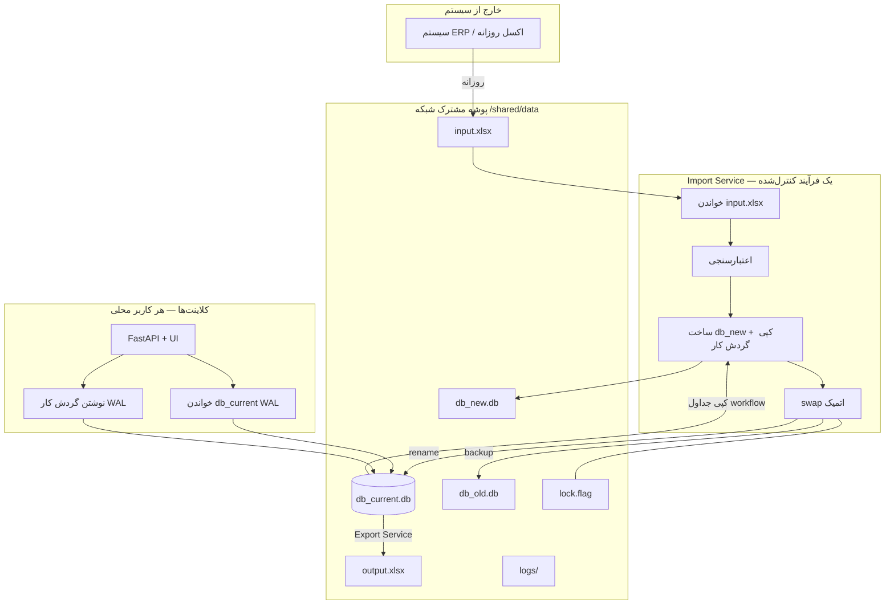

# معماری داده — سامانه تدارکات

## نمای کلی



## اصول

| قانون | توضیح |
|--------|--------|
| اکسل ورودی | **هیچ کلاینتی** مستقیم نمی‌خواند — فقط Import Service |
| منبع حقیقت | `db_current.db` (SQLite + WAL) |
| swap | فقط Import Service — با `lock.flag` |
| اکسل خروجی | از DB تولید می‌شود (`export_service`) — نه منبع |
| کلاینت | هر کاربر `./run.sh` محلی — DB روی share فقط خواندنی **برای purchases**؛ گردش کار با WAL |

## ساختار پوشه

```
data/   (یا TADAROKAT_SHARED_DATA)
  input.xlsx          ← اکسل روزانه (یا purchases.xlsx سازگاری)
  db_current.db       ← پایگاه فعال
  db_new.db           ← staging import
  db_old.db           ← نسخه قبلی (rollback)
  lock.flag           ← قفل هنگام swap
  output.xlsx         ← خروجی تولیدی
  logs/
  users.json          ← احراز هویت (محلی هر کلاینت یا share)
```

## جداول پایگاه

### metadata
- `meta`: `db_version`, `schema_version`, `last_import_at`, `last_import_sha256`, …
- `import_log`: تاریخچه import/swap

### خرید (فقط import)
- `purchases`: `purchase_number`, `row_json`, `imported_at`

### گردش کار (اپلیکیشن)
`purchase_edits`, `issued_inquiries`, `pre_invoices`, `pre_invoice_lines`,  
`orders`, `deliveries`, `product_history`, `notifications`, `edit_history`

## Import Service

1. خواندن `input.xlsx` + محاسبه SHA256
2. ساخت `db_new.db` با schema
3. **کپی تمام جداول گردش کار** از `db_current` (حفظ استعلام/دستور/تحویل)
4. جایگزینی `purchases` از اکسل
5. اعتبارسنجی (تعداد ردیف، افت مشکوک >50%)
6. `lock.flag` → `rename` اتمیک → حذف قفل
7. لاگ در `import_log` و `logs/import_*.json`

### اجرا

```bash
./scripts/run_import.sh
# یا زمان‌بندی: cron 06:00 daily
```

## همزمانی (Concurrency)

- **WAL mode**: چند خواننده + یک نویسنده همزمان
- **`PRAGMA busy_timeout=60000`**: retry خودکار روی share
- **هنگام swap**: `lock.flag` — کلاینت‌ها تا ۱۲۰ثانیه منتظر می‌مانند
- **نسخه‌گذاری**: `meta.db_version` — کلاینت در `/api/system/database` می‌بیند
- **Rollback**: اگر swap شکست بخورد، `db_old` → `db_current`

## متغیرهای محیطی

| متغیر | پیش‌فرض | کاربرد |
|--------|---------|--------|
| `TADAROKAT_SHARED_DATA` | `./data` | مسیر share |
| `TADAROKAT_INPUT_EXCEL` | `data/input.xlsx` | اکسل ورودی |
| `TADAROKAT_DB_CURRENT` | `data/db_current.db` | DB فعال |
| `TADAROKAT_STORAGE` | `sqlite` | `sqlite` یا `excel` (legacy) |
| `TADAROKAT_CLIENT_READ_ONLY` | `0` | `1` = بدون نوشتن مستقیم |
| `TADAROKAT_AUTO_MIGRATE` | `1` | مهاجرت اولیه از اکسل |
| `TADAROKAT_MODE` | `full` | `import` / `client` / `full` |

## API

- `GET /api/health` — وضعیت + قفل
- `GET /api/system/database` — نسخه DB و آمار
- `POST /api/system/import-excel` — admin: import دستی
- `POST /api/system/export-excel` — admin/manager: تولید output.xlsx

## استقرار چندکاربره

1. پوشه `data` روی share با دسترسی خواندن برای همه، نوشتن برای Import Service
2. هر کاربر: clone پروژه + `./run.sh` + `TADAROKAT_SHARED_DATA=//server/...`
3. یک ماشین/سرویس: `run_import.sh` روزانه پس از آپدیت `input.xlsx`
4. کلاینت‌ها هرگز `input.xlsx` را مستقیم نمی‌خوانند